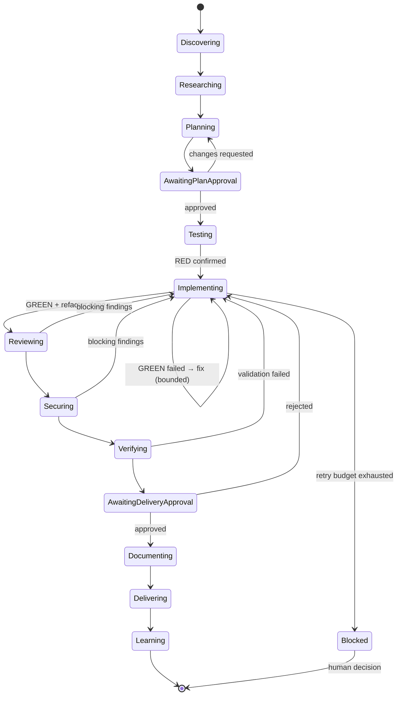
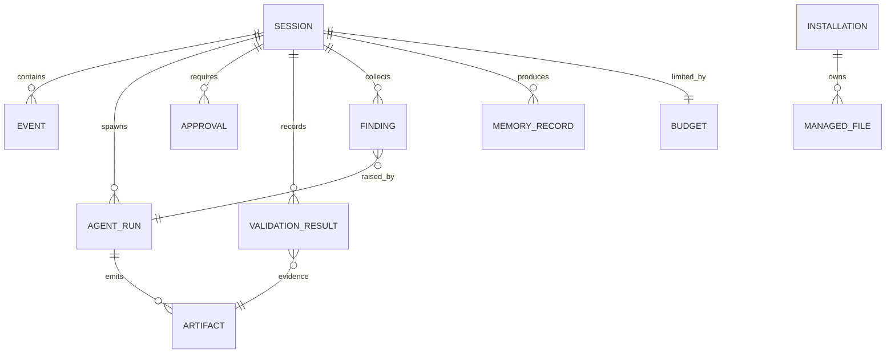

# Agentic Engineering Platform — Consolidated Design & Roadmap

> Status: Draft v1 · Source: analysis of `olddoc/{master,prompt,spec,architecture}.md`
> Purpose: one authoritative document that replaces the four older ones, fixes their inconsistencies, fills their gaps, and lays out how the system should grow.

---

## 1. What the Old Docs Say (Condensed)

| File | Role | Essence |
|---|---|---|
| `master.md` | Master prompt | Persona ("principal engineer + reviewer + security + QA") and the mission loop. **Truncated at line 16** — the body of the document is missing. |
| `prompt.md` | Operating prompt | 15 operating rules; discovery checklist; research-first, planning, TDD, review, security, memory and delivery rules. This is the de-facto content `master.md` was meant to hold. |
| `spec.md` | Specification | Components (agents, skills, commands, rules, hooks, memory, installer, orchestration), three JSON contracts (plan, review, validation), goals/non-goals, acceptance criteria. |
| `architecture.md` | Architecture | Layered model, runtime sequence, trust boundaries, ER model for state, install/hook/validation flows, failure handling, deployment modes, 12 principles. |

The common idea: **an evidence-driven, human-gated, fail-closed engineering workflow** that is portable across repositories and AI coding harnesses.

---

## 2. Analysis

### 2.1 Strengths worth keeping

1. **Fail-closed by default.** Missing reviewers are "unverified", security failures block, tests that didn't run are never "passed".
2. **Untrusted-content model.** Repo text, diffs, retrieved docs, model output *and memory* are all data, not instructions.
3. **Explicit contracts** (plan / review / validation JSON) instead of free-form hand-offs.
4. **Human approval gates** at plan and delivery; no unattended production actions.
5. **Skills canonical, commands thin.** Prevents logic drift between entry points.
6. **Installer discipline:** resolve → preview → apply, ownership tracking, drift detection, conservative uninstall.
7. **Bounded autonomy:** time, cost and iteration limits on loops.

### 2.2 Inconsistencies found

| # | Where | Problem | Resolution in this doc |
|---|---|---|---|
| 1 | `master.md` vs `prompt.md` | Loop order differs: master = `…review → verify → secure → document…`, prompt = `…review → secure → verify…`. Master adds `learn`; prompt doesn't. | Single canonical loop (§4.1); `secure` runs *before* final `verify` so the last full validation covers any security fixes; `learn` included. |
| 2 | `master.md` | Says it is to be copied into a repo as the master prompt, but contains only a stub. | Done: master prompt regenerated as `doc/master.md` (§10, Phase 0). |
| 3 | `spec.md` §4.1 vs `architecture.md` §5 | Architecture uses *Coordinator*, *Quality Reviewer*, *Language Reviewer*; spec's required agent list has neither. Spec's *Autonomous-loop operator* and *Release validator* never appear in the architecture. | Unified agent catalog (§5). |
| 4 | `spec.md` §4.6 vs `architecture.md` §7 | Memory fields differ: spec has `source, updated_at, related_files, related_sessions`; ER has `provenance` and lacks the rest. | Single memory schema (§6.4). |
| 5 | `spec.md` §5.2 | Review verdict is binary (`APPROVE`/`CHANGES_REQUESTED`) plus an `incomplete` flag, while the architecture says missing reviewers ⇒ *unverified*. A binary verdict can't express that cleanly. | Three-state verdict `APPROVE / CHANGES_REQUESTED / INCOMPLETE` (§6.2). |
| 6 | `prompt.md` rules 6–7 | "Wait for approval for broad changes" and "tests before implementation for *all* new behavior" have no definition of *broad* / *trivial*. | Change-size tiers with defined gate behavior (§4.2). |
| 7 | `spec.md` §4.3 | `/learn`, `/evolve`, `/repair` are listed with no definition of what they do. | Defined in §7. |
| 8 | `spec.md` §1 | "Inspired by ECC" — never defined. | Removed; the doc is self-contained. |
| 9 | `architecture.md` §7 | ER model has no entity for **approvals**, **findings**, **agent runs**, or **cost**, yet the whole design depends on them. | Added to state model (§6.5). |

### 2.3 Gaps (things the old docs never address)

- **No threat model.** "Treat as untrusted" is stated but there is no enumerated attacker, asset or mitigation (indirect prompt injection via issues/web/MCP, tool-output poisoning, malicious dependencies, memory poisoning).
- **No enforcement story.** Rules like "never claim tests passed" are *prompt-level*. Nothing says which are enforced *mechanically* (hooks, CI, schema validation) vs. merely requested.
- **No evaluation of the system itself.** No way to know whether the workflow actually improves output, or whether a change to a prompt/skill is a regression.
- **No cost / token budget model** beyond "bounded loops".
- **No concurrency model** for parallel agents sharing a working tree, session store, or memory (locking, worktree lifecycle, merge of results).
- **No versioning / migration** for schemas, skills, manifests, memory records.
- **No conflict resolution** between rule layers beyond "specific may override common" (who wins on security rules? Nothing may weaken them).
- **No observability spec** — the goal says "observable and auditable" but no event schema, trace IDs, or retention policy.
- **No definition of the approval gate mechanics** — who can approve, how it is recorded, how it expires when the plan changes.
- **No memory hygiene** — decay, dedup, contradiction handling, size caps, deletion/PII policy.
- **No failure taxonomy** or retry policy for flaky tests, tool timeouts, rate limits.
- **No adoption path** — how a team goes from zero to full profile, and how to measure value along the way.

---

## 3. Vision & Principles

**Vision:** a portable, auditable engineering system in which AI agents do the mechanical and analytical work while humans own decisions — and every claim ("tests pass", "no blocking findings") is backed by recorded evidence.

**Principles (merged from the 12 in `architecture.md` and the 15 rules in `prompt.md`):**

1. **Evidence over assertion.** A claim without a recorded artifact is `unverified`.
2. **Repository is the source of truth**; memory is a hint, never policy.
3. **Enforce, don't just ask.** Anything safety-critical must be backed by a hook, schema or CI check, not prose alone (§8.2).
4. **Fail closed.** Incomplete validation, missing reviewer, uncertain high severity ⇒ blocked.
5. **Plan before large change; test before behavior.** Scaled by change tier (§4.2).
6. **Fresh-context review** by an agent that did not write the code.
7. **External input is data.** No content channel can escalate its own privileges.
8. **Least privilege per agent** — tool allow-lists, read-only by default.
9. **Preview → apply → verify → recover** for every mutating operation.
10. **Bounded and observable autonomy** (time, tokens, cost, iterations; full trace).
11. **Skills canonical; adapters thin.** Harness-specific code only translates.
12. **User-owned files are never overwritten** without an ownership check.

---

## 4. Workflow

### 4.1 Canonical loop

```text
discover → research → plan ─▶[G1 plan approval]
        → test(RED) → implement(GREEN) → refactor
        → review → secure → verify ─▶[G2 delivery approval]
        → document → deliver → learn
```

Changes from the old docs: `secure` precedes the final `verify`; `document` sits after the last gate so docs describe what was actually approved; `learn` is a formal stage that writes memory (§6.4).

### 4.2 Change tiers (resolves old rules 6–7)

| Tier | Examples | Plan | Gate G1 | TDD | Review | Security |
|---|---|---|---|---|---|---|
| **T0 Trivial** | typo, comment, config value, formatting | none | none | n/a | self-check + lint | secret scan only |
| **T1 Small** | single-function fix/feature, ≤ ~3 files, no API/schema change | short plan (inline) | implicit if user asked for it | required | 1 fresh reviewer | standard |
| **T2 Standard** | multi-file feature, new endpoint, dependency add | full plan | **required** | required | quality + language + security | full |
| **T3 Broad / risky** | schema migration, auth change, cross-module refactor, infra, anything irreversible | full plan + rollback + threat notes | **required, named approver** | required + integration/E2E | adversarial verification | full + dependency audit |

Tier is proposed by the planner and can only be **raised** (never lowered) by later stages.

### 4.3 State machine (for the orchestrator)



Every transition emits an event (§6.4). A plan edit after G1 **invalidates** the approval.

---

## 5. Agent Catalog (unified)

Agents are read-only unless stated. Each definition must carry: name, purpose, activation, tool allow-list, input schema, output schema, safety constraints, validation requirements, failure behavior.

| Agent | Writes? | Role |
|---|---|---|
| **Coordinator** | no | Routes, tiers the change, spawns agents, enforces barriers and budgets. Never edits code. |
| **Explorer** | no | Repo discovery → *Evidence Packet* (languages, commands, entry points, CI, env vars, patterns). |
| **Researcher** | no | Official docs, dependency options → adopt / extend / compose / build recommendation with license, maintenance, security notes. |
| **Architect** | no | Design options and trade-offs for T2/T3. |
| **Planner** | no | Produces the Plan contract. |
| **TDD Implementer** | **yes** (worktree) | RED → GREEN → REFACTOR. |
| **Build-Error Resolver** | yes | Minimal fixes for compile/type/lint failures, no scope creep. |
| **Test Analyst** | no | Coverage gaps, flaky-test triage, test-quality critique. |
| **Quality Reviewer** | no | Correctness, regressions, maintainability. |
| **Language Reviewer** | no | Idiom and framework-specific issues (loaded per language skill). |
| **Security Reviewer** | no | Injection, authZ, secrets, SSRF, path traversal, unsafe autonomy. |
| **Adversarial Verifier** | no | Tries to *refute* each finding; classifies confirmed / unverified / refuted. |
| **Refactoring Specialist** | yes | Behavior-preserving cleanup with tests green. |
| **E2E Tester** | no | Drives real flows; records evidence. |
| **Docs Updater** | yes (docs only) | README/API/runbook/changelog. |
| **Release Validator** | no | Migration, rollback, packaging, version checks. |
| **Loop Operator** | no | Runs bounded autonomous iterations; owns kill-switch. |

Rule: **the agent that wrote a diff can never be its reviewer.**

---

## 6. Contracts & State

### 6.1 Plan contract (v2)

```json
{
  "schema": "plan/2",
  "tier": "T0|T1|T2|T3",
  "requirements": [],
  "user_journeys": [],
  "scope": [],
  "non_goals": [],
  "files": [{"path": "", "change": "add|modify|delete", "pattern_to_mirror": ""}],
  "dependencies": [{"name": "", "decision": "adopt|extend|compose|build", "rationale": ""}],
  "phases": [{"id": "", "goal": "", "tests_first": []}],
  "risks": [{"risk": "", "mitigation": ""}],
  "security_plan": [],
  "rollback": "",
  "validation": [],
  "acceptance": [],
  "plan_hash": "sha256"
}
```

`plan_hash` is what an approval binds to. `validate.py plan-hash` computes and verifies it.

### 6.2 Review contract (v2)

```json
{
  "schema": "review/2",
  "id": "",
  "verdict": "APPROVE | CHANGES_REQUESTED | INCOMPLETE",
  "reviewers": [{"agent": "", "status": "ok|failed|timeout"}],
  "findings": [{
    "id": "", "severity": "CRITICAL|HIGH|MEDIUM|LOW|INFO",
    "file": "", "symbol_or_line": "",
    "evidence": "", "impact": "", "fix": "",
    "verification": "confirmed|unverified|refuted",
    "blocking": true
  }],
  "stats": {"raw": 0, "unique": 0, "confirmed": 0, "unverified": 0, "refuted": 0}
}
```

Derivation rules (deterministic, computed by code not by the model; enforced by `validate.py review`):
- any reviewer `failed|timeout` ⇒ `INCOMPLETE`
- any non-refuted CRITICAL/HIGH ⇒ `blocking = true` ⇒ `CHANGES_REQUESTED`
- `unverified` CRITICAL/HIGH stays blocking (per old architecture §11)

### 6.3 Validation contract (v2)

```json
{
  "schema": "validation/2",
  "id": "",
  "command": "",
  "cwd": "",
  "status": "passed|failed|skipped|unverified",
  "exit_code": 0,
  "duration_ms": 0,
  "summary": "",
  "evidence_ref": "path-or-hash-of-captured-output",
  "git_head": "",
  "worktree_dirty": false
}
```

New: `git_head` and `worktree_dirty` tie evidence to the exact code state; evidence goes stale when the tree changes.

### 6.4 Memory record (single schema)

```text
id, scope(project|user|team), kind(decision|fact|lesson|context|preference|runbook|handoff|eval),
title, body, source, provenance(session/agent/commit),
created_at, updated_at, expires_at?, related_files[], related_sessions[],
confidence(0–1), verified_at?, verified_against(git_head)?, supersedes?
```

Memory rules (new): every recall is re-verified against the repo before being used as a fact; records referencing missing files are auto-flagged stale; contradicting records are linked, not silently merged; secrets/PII are rejected at write time.

### 6.5 State model (extended ER)

Adds to the old model: **APPROVAL** (gate, approver, plan_hash, granted_at, expires_at), **FINDING**, **AGENT_RUN** (agent, model, tokens_in/out, cost, duration, status, parent_run), **BUDGET** (limits & consumption), **ARTIFACT** (captured logs/diffs, content-hashed).



---

## 7. Commands (defined)

| Command | Behavior |
|---|---|
| `/plan` | Runs discover → research → plan; stops at G1. |
| `/implement` | Requires approved plan hash; runs TDD loop. |
| `/code-review` | Fresh-context multi-reviewer pass over a diff → Review contract. |
| `/security-scan` | Security Reviewer + secret/dependency scanners. |
| `/build-fix` | Build-Error Resolver, minimal edits, bounded retries. |
| `/test-coverage` | Test Analyst report; proposes tests, does not write them silently. |
| `/refactor-clean` | Behavior-preserving; requires green baseline first. |
| `/update-docs` | Docs Updater against actual diff. |
| `/save-session` `/resume-session` | Persist / restore state incl. plan hash, approvals, open findings. |
| `/learn` | Propose memory records from the session (**human-confirmed** before write). |
| `/evolve` | Propose edits to skills/rules based on recurring lessons and eval results — output is a **PR against the platform repo**, never a silent self-edit. |
| `/loop-start` `/loop-status` `/loop-stop` | Bounded autonomous loop with budget and kill-switch. |
| `/doctor` | Read-only health check: install drift, hook status, schema versions, stale memory. |
| `/repair` | Fixes only *managed* files reported by `/doctor`; dry-run first. |
| `/uninstall` | Removes managed files only; leaves user-owned files. |

---

## 8. Safety & Security

### 8.1 Threat model (initial)

| Threat | Vector | Mitigation |
|---|---|---|
| Indirect prompt injection | Issue bodies, web pages, MCP responses, code comments, diffs | Content wrapped/tagged as data; agents that ingest untrusted content have **no write or network-egress tools**; results pass through schema validation before reaching a privileged agent. |
| Memory poisoning | Malicious or wrong record persisted | Human-confirmed writes, provenance, verify-on-recall, TTL. |
| Malicious dependency | Typosquat, compromised package | Researcher checks; install requires approval; lockfile + audit in CI. |
| Secret leakage | Logs, memory, commits, prompts | Pre-commit + pre-tool secret scan; redaction in structured logs; secrets injected at runtime only. |
| Destructive commands | `rm -rf`, force-push, DB drop | PreToolUse deny-list + allow-list by tier; irreversible ops always require G-level approval. |
| Reviewer collusion / rubber-stamping | Same context reviews own work | Fresh context, different agent, adversarial verifier, deterministic verdict derivation. |
| Runaway loops / cost | Autonomous iterations | Hard budgets (time, tokens, $, iterations) enforced by runtime, not by the agent. |
| Cross-agent state corruption | Parallel writers | One git worktree per writing agent; append-only event log; single-writer for shared stores. |

### 8.2 Enforcement matrix (which rules are mechanical)

| Rule | Prompt | Hook | Schema/Code | CI |
|---|:-:|:-:|:-:|:-:|
| Never claim tests passed without running | ✔ | | ✔ (validation record required for claim) | ✔ |
| No secrets committed | ✔ | ✔ | | ✔ |
| Approval before T2/T3 implementation | ✔ | ✔ (block write tools until approval) | ✔ (`plan_hash`) | |
| Blocking findings block delivery | ✔ | | ✔ (derived verdict) | ✔ |
| Reviewer ≠ author | ✔ | | ✔ (agent-run ids) | |
| Loop budgets | | | ✔ (runtime) | |
| Install ownership | | | ✔ (checksums) | |

Target: no safety-critical rule is enforced by prose alone.

### 8.3 Rule layering & precedence

`project > framework > language > common` for style and workflow — **except** security rules, which are a floor: lower layers may add restrictions but never relax them.

---

## 9. Deployment Modes (retained, with additions)

| Mode | Adds beyond old doc |
|---|---|
| **Local** | Local SQLite/JSONL store; no network writes by default. |
| **Team** | Shared rule/skill repo with versioned releases; CI runs `/doctor` + schema validation; shared memory with review workflow. |
| **Enterprise** | SSO-bound approvers, signed skills/manifests, immutable audit export (OTLP / SIEM), policy-as-code (OPA-style), egress allow-lists, per-team budgets. |

---

## 10. Roadmap & Future Enhancements

### Phase 0 — Foundations (1–2 weeks)
- ✅ Regenerated master prompt: `doc/master.md` (persona, loop, tiers, gates, failure behavior; supersedes `olddoc/master.md` and `olddoc/prompt.md`).
- ✅ Frozen v2 JSON Schemas in `doc/schemas/`: `plan`, `review`, `validation`, `approval`, `memory`, `event`.
- ✅ Validator CLI: `doc/tools/validate.py` (schema check, derived review verdict, `plan_hash`, approval-binding check; 43 tests in `doc/tools/tests/`).
- ✅ Event schema with `trace_id` / `run_id` / `parent_run_id` (`doc/schemas/event.schema.json`).

### Phase 1 — Enforceable core (2–4 weeks) — implemented for Claude Code, see §14
- ✅ Hooks: block writes outside an approved plan's scope (T2+ need G1), secret scan, dangerous-command guard, delivery gating on G2 scope, validation-evidence recorder.
- ✅ Deterministic verdict derivation in code (`validate.py review`).
- ✅ Installer: `init` / `uninstall` with `--dry-run`, `--json`, ownership manifest; `doctor`.
- ⬜ Profiles: `minimal`, `core` (single profile today).
- ⬜ `/repair` (doctor reports drift; fixing is by re-running `init`).

### Phase 2 — Multi-agent orchestration (4–6 weeks)
- Coordinator with barriers and budgets; worktree-per-writer; append-only event log.
- Reviewer fan-out + finding dedup + adversarial verification.
- Language/framework skill packs (start with the team's top 2 stacks).

### Phase 3 — Memory & learning (4–6 weeks)
- Memory store with verify-on-recall, TTL, contradiction linking, PII/secret filter.
- `/learn` and session handoff; recall ranking by file/path relevance.
- Context budgeting: on-demand skill loading, evidence packets instead of raw file dumps.

### Phase 4 — Evaluation harness (parallel from Phase 2)
- **Golden tasks:** a versioned suite of repo + task + expected-outcome cases (bug fixes, features, planted vulnerabilities, planted prompt injections).
- Metrics: task success, first-pass test success, escaped-defect rate (planted bugs missed by review), false-positive rate, tokens & cost per task, time-to-approval, human-override rate.
- Every change to a skill/rule/prompt runs the suite; regressions block merge. `/evolve` proposals must show eval deltas.

### Phase 5 — Ecosystem & scale
- Harness adapters (Claude Code, Cursor, Codex-style CLIs, IDE plugins) generated from canonical skills.
- MCP integration layer with per-server trust levels and egress policy.
- Work-item integrations (GitHub/Jira/Linear) — read-first, write only with approval.
- Dashboard: sessions, findings trend, cost, gate latency, drift.
- Signed skill/manifest distribution; version pinning and migration tooling (`schema/N → N+1`).
- Local/self-hosted model support with capability profiles (which agents may run on weaker models; security review never downgraded silently).

### Future ideas (unscheduled)
- **Risk-adaptive routing:** pick tier, reviewer count and model size from diff features (touches auth? migrations? size? churn/hotspot files?).
- **Mutation-testing gate** for T2/T3 to measure test quality, not just coverage.
- **Property-based / fuzz test generation** for parsers and validators.
- **Automated dependency-upgrade agent** with staged canary PRs.
- **Incident-to-regression loop:** production incident → failing test → memory lesson → new rule candidate.
- **Cost-aware planning:** planner estimates tokens/$ and shows it at G1.
- **Reproducible sessions:** replay a session from its event log for debugging or audit.
- **Cross-repo knowledge** (org-level patterns) with strict scope isolation.
- **Reviewer calibration:** track per-reviewer precision over time; weight or retire noisy reviewers.
- **Formal policy language** for approvals (e.g., "DB migrations need DBA + tech-lead").

---

## 11. Success Metrics

| Outcome | Metric | Initial target |
|---|---|---|
| Correctness | First-pass CI green rate on agent PRs | > 80% |
| Trust | Claims without evidence record | 0 |
| Safety | Planted-vuln detection on golden set | > 90% |
| Noise | Review false-positive rate | < 20% |
| Efficiency | Median tokens/cost per T1 task | tracked, then reduced 20% |
| Human load | Gate decisions needing rework | trending down |
| Adoption | Repos with `/doctor` clean | tracked |

---

## 12. Open Questions (need a human decision)

1. Which harness(es) are first-class — determines hook capabilities and Phase 1 scope.
2. Storage for state: files/JSONL in-repo, local SQLite, or a service? (Affects team mode.)
3. Who are valid approvers per gate, and how is identity established locally?
4. Is shared team memory in scope for v1, or local-only?
5. Compliance needs (SOC 2 / ISO) that would pull enterprise audit features forward?
6. Target languages/frameworks for the first skill packs.
7. Budget defaults (tokens, $, wall-clock) per tier.

---

## 13. Traceability to Old Docs

| Old content | Where it lives now |
|---|---|
| `master.md` mission loop | §4.1 |
| `prompt.md` operating rules 1–15 | §3 principles, §4.2 tiers, §8 |
| `prompt.md` repo discovery / research-first / planning / TDD / review / security / memory / delivery rules | `doc/master.md` (§2–§16), agent definitions (§5), contracts (§6) |
| `spec.md` §4 components | §5, §7, §6.4, §9 |
| `spec.md` §5 contracts | §6.1–6.3 (v2) |
| `spec.md` §3, §6–8 non-goals/quality/ops/acceptance | §3, §8, §11 |
| `architecture.md` §1–3, §5 | §4.3, §5 |
| `architecture.md` §6 trust boundaries | §8.1 |
| `architecture.md` §7 ER | §6.5 |
| `architecture.md` §8–9 installer/hooks | §7 (`/doctor`, `/repair`), Phase 1 |
| `architecture.md` §11–13 failure handling / modes / principles | §3, §4.3, §9 |

---

## 14. Implementation Status (Phase 1, Claude Code)

Code lives at the repo root, separate from these docs: `agentic/` (package), `scripts/agentic.py` (launcher), `schemas/`, `tests/` (126 tests), plus `.claude/` and `.agentic/` (this repo installed in **warn** mode).

### 14.1 What maps to what

| Design element | Implementation |
|---|---|
| Plan contract, tier floor (§4.2) | `schemas/plan.schema.json`, `policy.tier_floor`, `cli plan new/seal` |
| G1 (plan approval) | `hooks._decide_gate`: only a **user prompt** (`/approve G1`) can create an approval; bound to `plan_hash`; any plan edit voids it |
| G2 (delivery approval) | Same path, but refused unless review, validations, commit and clean tree all check out (`validate.check_approval_docs`); explicit **scope** (`commit push open-pr merge publish deploy`) |
| "Write only in scope" (master §2.4) | `policy.decide_write`: writes must match `plan.files`; protected paths and platform code are unwritable |
| Delivery only after G2 | `policy.decide_bash`: `git push`, `npm publish`, `terraform apply`, `gh pr create`... need a G2 whose scope lists them and whose commit is still HEAD |
| Evidence over assertion | `hooks._record_validation`: validations come from real command runs, never from the agent; only faithful `&&`-chain runs count |
| Secrets | `secretscan`: blocks writes/commands, redacts evidence, never echoes values |
| Audit | `.agentic/events.jsonl` (`event/1`), append-only, redacted |
| `/doctor`, install/uninstall | `doctor.py` (includes a live self-test of the launcher and guard), `install.py` |

### 14.2 Facts verified against a live Claude Code 2.1.278 session (2026-09-20)

- Exit code 2 from a `PreToolUse` hook blocks the call and the stderr message reaches the model.
- `UserPromptSubmit` payload carries the raw text in **`prompt`**; plain stdout is delivered to the model as context.
- `Write` input keys are `file_path` and `content`; `Bash` input keys are `command` and `description`.
- Bash **success** fires `PostToolUse` with `tool_response = {stdout, stderr, interrupted, isImage, noOutputExpected}` and **no exit code**. Bash **failure** fires `PostToolUseFailure` with `error: "Exit code N"` and `is_interrupt`. The recorder relies on exactly this.
- Hook configuration changes take effect in a running session (installing into this repo activated the hooks immediately).

Not verified live (unit tests only): `Edit`, `MultiEdit`, `NotebookEdit` payload shapes, `ask` decisions, subagent calls, Linux/macOS.

### 14.3 Known limitations

1. **Bash write detection is best-effort.** Redirects, `tee`, `sed -i`, `cp/mv/rm/touch` are checked; heredocs, `python -c`, `xargs`, `eval` and obfuscated commands can bypass the *scope* check. Protected-path and forgery rules are textual: they can be evaded by determined obfuscation, and they can also false-positive (a command that merely *mentions* a protected path, e.g. while editing docs about it, is blocked). The design assumes a well-meaning but fallible agent, not a hostile one.
2. **Reviews are self-attested.** `.agentic/review.json` is written by the agent; the verdict is re-derived from findings, but a reviewer that omits findings is not detected. "Reviewer ≠ author" needs Phase 2 orchestration (separate agent runs).
3. **Identity is local.** The approver is the OS user; `approvers` config restricts by name only.
4. **Untracked install files count as dirt.** After `init`, commit `.claude/` before a G2 (the tree must be clean; `.agentic/` is excluded).
5. **Not implemented:** budgets/loop limits, Stop hook, memory, `/learn`, `/evolve`, subagent definitions, profiles, `/repair`, the evaluation harness.
6. **Hooks fail open outside `pre-tool-use`.** A crashing post/prompt/session hook logs and continues; `pre-tool-use` fails closed.

### 14.4 Lessons recorded during implementation

- Root discovery must never treat `.claude/` as a project marker (`~/.claude` exists for everyone); an early smoke test installed hooks globally and had to be reverted. `init` now takes `--dir` or the current directory exactly and refuses the home directory (`tests/test_install_cli.py::test_refuses_the_home_directory`).
- Second-resolution timestamps made "latest approval/validation wins" ambiguous within one second; ids and `decided_at` now use microseconds.
- Writes outside the project are only safe if the hook code and `~/.claude/settings*.json` are protected; both are now hard-denied.
- Fetched documentation about hook payloads was partly wrong (field names, exit codes). Everything in 14.2 was confirmed by capturing real payloads (`AGENTIC_HOOK_DEBUG=1`).
