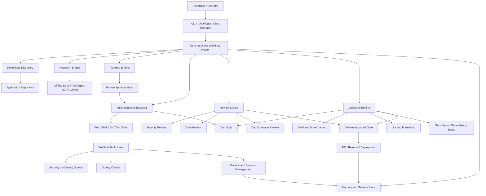
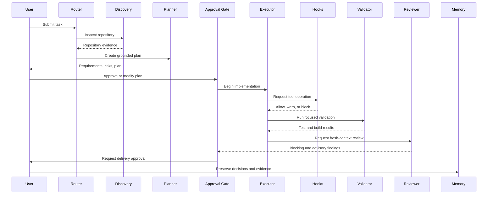
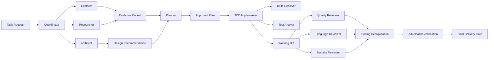
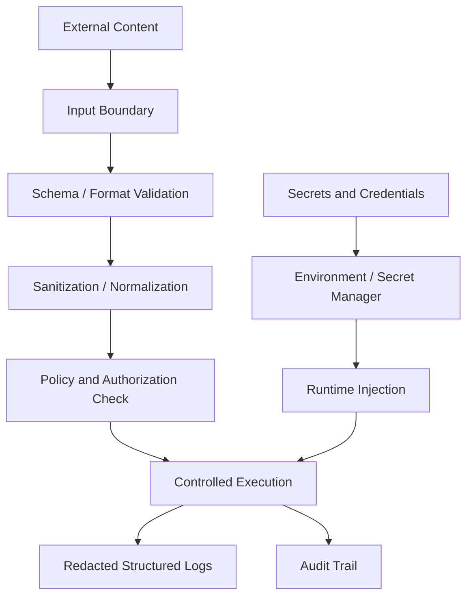
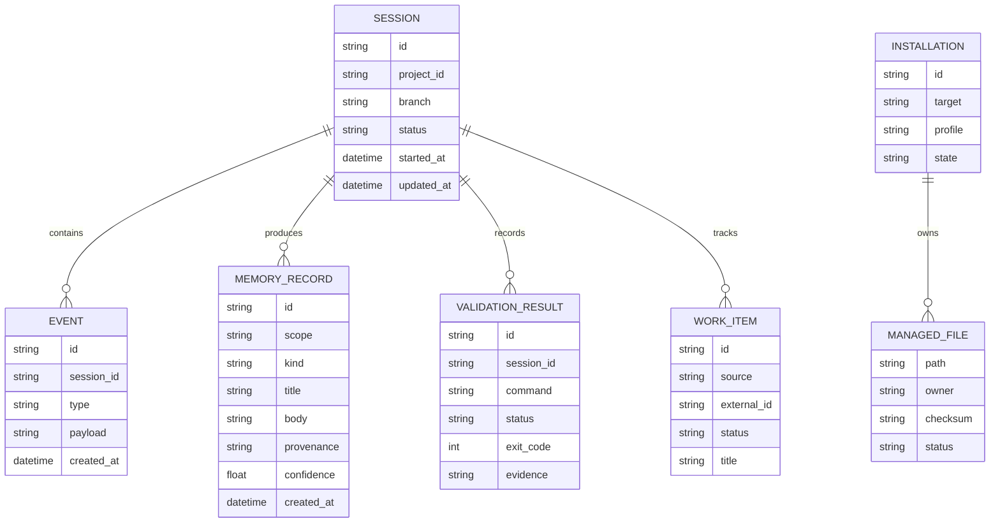
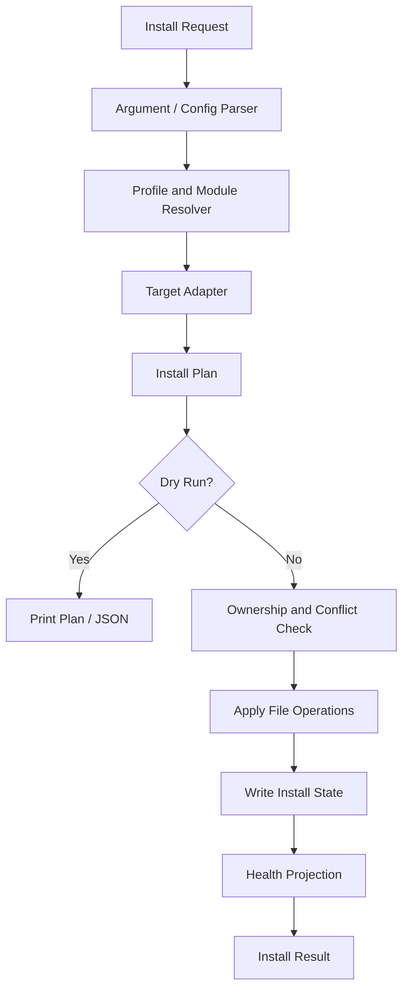
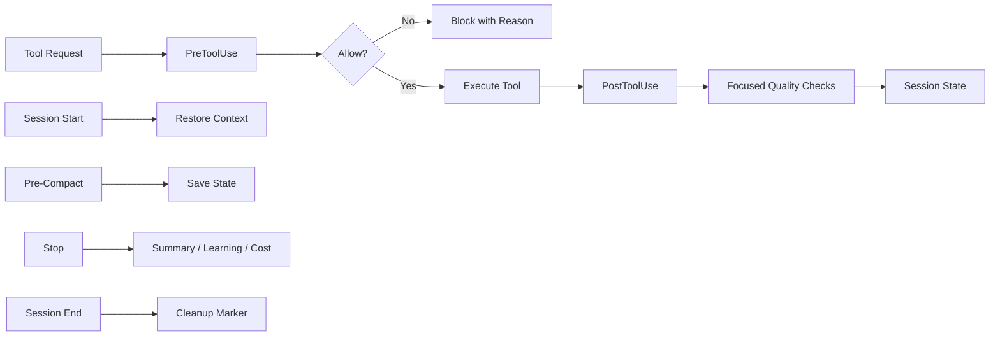
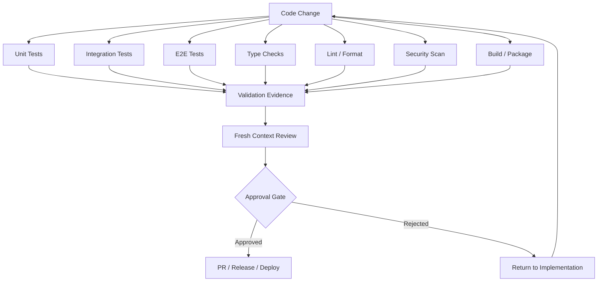

# Universal Agentic Application Development Architecture

## 1. Architecture Overview

The system is organized as a reusable agentic engineering platform around a project repository.



## 2. Layered Architecture

```text
┌──────────────────────────────────────────────────────────┐
│                     User Interfaces                       │
│          CLI · IDE Plugin · Chat · Dashboard              │
├──────────────────────────────────────────────────────────┤
│                 Commands and Workflows                    │
│       plan · implement · review · verify · release        │
├──────────────────────────────────────────────────────────┤
│                    Agent Runtime                          │
│    routing · delegation · parallelism · barriers           │
├──────────────────────────────────────────────────────────┤
│                    Safety Layer                            │
│    approvals · trust boundaries · secret protection        │
├──────────────────────────────────────────────────────────┤
│                  Hook and Quality Layer                    │
│   pre-tool · post-tool · session · compaction · audits     │
├──────────────────────────────────────────────────────────┤
│                  Knowledge Layer                          │
│   agents · skills · rules · prompts · templates · schemas  │
├──────────────────────────────────────────────────────────┤
│                    State Layer                             │
│ sessions · memory · install state · work items · metrics  │
├──────────────────────────────────────────────────────────┤
│                  Project Integration Layer                 │
│ filesystem · git · package manager · tests · CI · MCP      │
└──────────────────────────────────────────────────────────┘
```

## 3. Main Runtime Flow



## 4. Repository-Centric Component Model

```text
project/
├── app/ or src/             Application implementation
├── tests/                   Unit, integration, and E2E tests
├── agents/                 Specialized agent instructions
├── skills/                 Reusable workflows and domain knowledge
├── commands/               User-facing workflow entry points
├── rules/                  General and stack-specific standards
├── hooks/                  Lifecycle and tool-use automation
├── scripts/                Installation, validation, maintenance, and CLI utilities
├── schemas/                Input, output, configuration, and state validation
├── manifests/              Profiles, modules, and install components
├── docs/                   Architecture, operations, security, and user documentation
├── examples/               Reference configurations and templates
└── .github/                CI, issue templates, PR workflows, and automation
```

## 5. Agent Execution Architecture

Agents should communicate through explicit contracts rather than free-form hidden state.



## 6. Trust and Security Boundaries



External content includes:

- User-provided text
- Repository files
- GitHub issues and pull requests
- Diffs
- Retrieved web pages
- MCP responses
- Model output
- Memory records
- Generated plans

None of these should override system instructions or execute automatically without validation.

## 7. State and Memory Architecture



## 8. Installation Architecture



Installation principles:

- Resolve before mutating.
- Preview before applying.
- Track ownership.
- Preserve unrelated user files.
- Detect drift.
- Repair only managed files.
- Uninstall conservatively.
- Keep operations idempotent.

## 9. Hook Architecture



Hooks should have:

- Stable identifiers
- Explicit matchers
- Timeout limits
- Profile controls
- Disabled-hook overrides
- Structured logs
- Safe failure behavior
- Independent tests

## 10. Validation and Delivery Architecture



## 11. Failure Handling

The architecture must fail safely.

Required behaviors:

- Failed agents are reported.
- Missing reviewers are marked unverified.
- Security failures block delivery.
- Invalid inputs fail before mutation.
- Partial installs record state and warnings.
- External action requires approval.
- Autonomous loops have time, cost, and iteration limits.
- Uncertain high-severity findings remain blocking.
- Unsupported platforms produce explicit warnings.
- Tests that cannot run are not reported as passing.

## 12. Recommended Deployment Modes

### Local Developer Mode

- CLI
- Local hooks
- Local memory
- Project-local configuration
- No external writes by default

### Team Mode

- Shared rules
- Shared skills
- CI validation
- Centralized documentation
- Optional shared memory and work-item integrations

### Enterprise Mode

- Managed installation
- Stronger audit logging
- Secret manager integration
- Policy enforcement
- Approval workflows
- Isolated execution
- Cost and usage reporting

## 13. Architectural Principles

1. The repository is the source of truth.
2. Skills are canonical; commands are convenience wrappers.
3. Plans precede complex implementation.
4. Tests provide behavioral evidence.
5. Reviews happen from a fresh context.
6. Security checks fail closed.
7. User-owned configuration is preserved.
8. External actions require approval.
9. Memory is durable but untrusted.
10. Autonomous work is bounded and observable.
11. Adapters should reuse core workflows instead of copying them.
12. Every important operation should support preview, validation, and recovery.